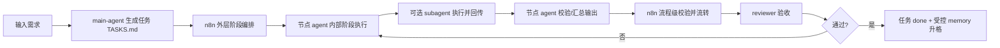

# agent-build v0.12

`agent-build` 是一个面向 **n8n 外层流程编排 + 节点级复合 agent 内部微流程** 的工程模板。

本模板固化以下原则：

- n8n 管流程。
- agent 管阶段。
- subagent 内聚。
- memory 分层。
- task-first。
- review-gated。

## 1. 模板定位

本模板用于构建可审计、可扩展的 AI 生产流水线工程，尤其适用于：

- 需要外层工作流编排与内层智能决策解耦的项目。
- 需要节点内部多阶段处理和中间 JSON 校验的项目。
- 需要 subagent 生命周期管理与 memory 分层治理的项目。

## 2. 三层架构

### 2.1 外层：n8n 编排层

负责：

1. 阶段顺序执行。
2. 数据流转（统一 JSON）。
3. 条件分支。
4. 重试与中断。
5. 日志与可观测性。
6. 流程级校验（格式、字段）。

不负责：

1. 内容生成与推理。
2. subagent 调度。
3. memory 写入。
4. 内容质量判断。

### 2.2 中层：节点级复合 agent

每个核心节点是阶段控制器，不是一次函数调用。它可以：

1. 内部阶段拆分（stage pipeline）。
2. subagent 创建与回收。
3. memory 分层读取与写回控制。
4. 中间 JSON 校验。
5. 失败回退与重试。
6. 结果汇总输出。

### 2.3 内层：subagent 执行层

特点：

1. 短生命周期。
2. 单一任务。
3. 不参与流程调度。
4. 不允许直接写长期 memory。
5. 输出必须先返回节点 agent。

## 3. simple vs composite 节点判断

复合节点判定规则：满足以下任意两条即为 `composite`：

1. 不是一次能稳定完成。
2. 需要多阶段加工。
3. 存在中间 JSON。
4. 需要自检或 reviewer。
5. 可拆分为子任务。

否则可定义为 `simple`。

### 文生视频标准阶段示例

1. `script-agent`（通常 composite）
2. `tts-agent`（通常 simple，可升级 composite）
3. `storyboard-agent`（通常 composite）
4. `asset-agent`（通常 composite）
5. `editor-agent`（通常 simple，可升级 composite）
6. `review-agent`（通常 composite）

## 4. subagent 内部机制

1. subagent 只由节点 agent 创建与回收。
2. subagent 不允许串联调用。
3. subagent 所有结果先回节点 agent。
4. 下一步由节点 agent 决策。
5. subagent 不可写 Global/Node Memory。

## 5. memory 分层

四层结构：

1. `Global Memory`：全局规则与跨任务决策。
2. `Node Memory`：节点能力与局部策略。
3. `Task Context`：任务上下文与阶段索引。
4. `Ephemeral Memory`：临时推理与中间产物。

升格到长期 memory（Global/Node）必须同时满足：

1. 多次验证。
2. 确认提升质量。
3. reviewer 间接确认。

## 6. 双层质量控制

### 6.1 n8n 流程级质量控制

1. JSON 结构校验。
2. 必填字段校验。
3. 基础可执行性校验。

### 6.2 节点 agent 内容质量控制

1. 逻辑正确性。
2. 结构合理性。
3. 节奏与一致性。
4. 是否允许进入下一阶段。

## 7. n8n 集成方式

1. n8n 每个大阶段调用一个节点 agent。
2. 节点 agent 内部按统一阶段协议执行。
3. 阶段协议见 `specs/node-stage-schema.yaml`。
4. 节点结果统一 JSON 回传 n8n。

## 8. 初始化方法

1. 运行 `scripts/init-project.sh <project-name>`（Linux/macOS）。
2. 或运行 `scripts/init-project.ps1 -ProjectName <project-name>`（Windows）。
3. 更新 `docs/n8n-integration.md` 与 `TASKS.md`。
4. 按 `workflows/composite-agent-flow.md` 落地复合节点。

## 9. 使用流程



## 10. 推荐目录用途

```text
.
|- README.md
|- CLAUDE.md
|- MEMORY.md
|- TASKS.md
|- agents/                     # 角色职责与权限边界
|- prompts/                    # 角色系统提示词
|- skills/                     # 可复用技能（含 failure/escalation）
|- docs/
|  |- architecture.md
|  |- node-agent-pattern.md
|  |- memory-layering.md
|  |- n8n-integration.md
|  `- composite-agent-flow.md
|- specs/
|  |- task-schema.yaml
|  |- node-stage-schema.yaml
|  `- memory-layer-schema.yaml
|- workflows/
|  |- task-lifecycle.md
|  |- composite-agent-flow.md
|  |- bugfix-flow.md
|  `- release-flow.md
|- scripts/
|  |- init-project.sh
|  `- init-project.ps1
`- workspace/
```
