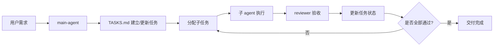

# agent-build

一个面向 AI Agent / 自动化项目的通用模板仓库，强调“任务驱动、主控调度、子代理单责、可审计交付”。

## 项目目标

`agent-build` 用于快速初始化任何 AI Agent 工程，兼容 Claude Code / Codex / OpenClaw 等工作方式。

本模板强制落实以下原则：

1. 任务驱动（Task-first）
2. 单主控 agent（Main Loop）
3. 子 agent 单一职责
4. 所有规则文件化
5. 所有行为经过 `TASKS.md`
6. 强制 reviewer 验收

## 主控执行循环

用户需求 -> `main-agent` -> 生成或更新 `TASKS.md` -> 分派子任务 -> 子 agent 执行 -> `reviewer` 验收 -> 更新任务状态 -> 循环直到全部完成。



## 目录说明

```text
.
|- README.md
|- CLAUDE.md
|- MEMORY.md
|- TASKS.md
|- prompts/      # 各角色 system prompt
|- agents/       # 角色职责边界（能做/不能做）
|- skills/       # 可复用执行技能
|- docs/         # 产品/架构/决策/变更记录
|- specs/        # API/数据模型/验收标准
|- workflows/    # 任务、缺陷、发布流程
`- workspace/    # 执行产物与临时文件
```

## 快速开始

1. `git init`
2. 阅读 `CLAUDE.md` 与 `TASKS.md`，确认约束和任务流转。
3. 在 `docs/` 和 `specs/` 填充你的项目上下文。
4. 在 `TASKS.md` 建立首批任务并进入主循环。
5. 仅在 reviewer 验收通过后将任务标记为 `done`。

## 执行约束

1. 没有任务卡，不执行任何改动。
2. 子 agent 不得越权改动未授权范围。
3. 审核不通过必须回到 `in_progress` 或 `blocked`。
4. 架构与关键决策必须记录到 `MEMORY.md` 与 `docs/decisions.md`。
5. 发布前必须满足 `specs/acceptance.md`。
